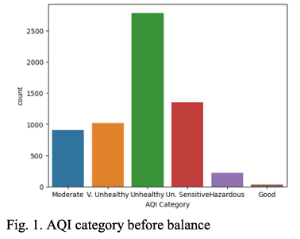
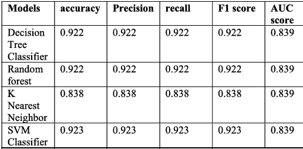
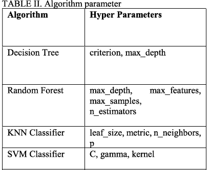

# Air Quality Analysis in Dhaka

## Project Overview
This project analyzes PM2.5 air quality data for Dhaka, focusing on trends, preprocessing, and preparing data for machine learning models. The dataset contains hourly air quality measurements, including parameters like AQI (Air Quality Index), NowCast Concentration, and AQI Category, which are used to assess pollution levels.

The project was developed as part of the CSE445 Machine Learning course at North South University.

---

## Dataset
The dataset includes the following attributes:
- **Site:** The location of data collection (e.g., Dhaka).
- **Parameter:** The measured air quality parameter (e.g., PM2.5 - Principal).
- **Date (LT):** Local time of the recorded measurement.
- **Year, Month, Day, Hour:** Extracted time details.
- **NowCast Concentration:** Real-time concentration measurement.
- **AQI (Air Quality Index):** A standardized measure of air quality.
- **AQI Category:** Classification of air quality (e.g., Moderate, Unhealthy).
- **Raw Concentration:** Unprocessed concentration values.
- **Duration and QC Name:** Duration of data collection and quality control status.

### Category Visualization

---

## Tools and Libraries Used
- **Python Libraries:**
  - `numpy`, `pandas`: Data manipulation and analysis.
  - `matplotlib`, `seaborn`: Data visualization.
  - `scikit-learn`: Machine learning utilities for splitting datasets.

---

## Results
- The SVM Classifier achieved the highest accuracy of 0.923, followed closely by Decision Tree Classifier and Random Forest, both with an accuracy of 0.922.
- These models also demonstrated equivalent values for precision, recall, F1 score, and AUC score, indicating consistent and reliable performance across all evaluation metrics.
- The K-Nearest Neighbor (KNN) model performed relatively poorly, with an accuracy, precision, recall, and F1 score of 0.838.
- This summary suggests that SVM, Decision Tree, and Random Forest are more suitable for this dataset, given their superior and consistent performance.

### Results Visualization

### Hyperparameters Visualization

---

## Contributors
- **Jannat Sultana** - North South University
- **Ahmed Kiser** - North South University

---

## Acknowledgments
This project was developed as part of the CSE445 Machine Learning course under the guidance of **Sarnali Basak (SLB)**.

